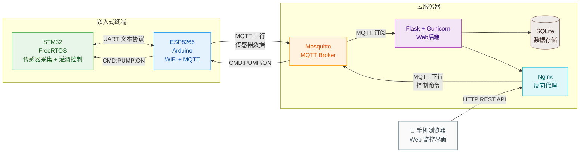
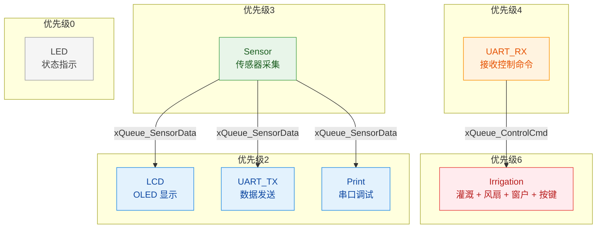

# 🌱 SmartFarm

> 基于STM32的智能农业监测与灌溉控制系统

## 简介

一套完整的智慧农业解决方案，实现环境监测、自动灌溉、远程控制。

**核心功能：**
- 📊 多传感器实时监测（温湿度、土壤、光照、CO2、气压）
- 💧 自动灌溉控制（土壤湿度阈值触发）
- 🌡️ 自动环境调节（风扇降温、窗户通风）
- 📱 手机Web远程监控
- ⚡ 断电检测与切换

## 技术栈

| 端 | 技术 |
|---|---|
| 嵌入式 | STM32F103C8T6 + FreeRTOS + HAL |
| 通信 | ESP8266 + MQTT |
| 后端 | Flask + SQLite + Gunicorn |
| 部署 | 腾讯云 + Nginx + systemd |

## 项目结构

```
├── Code/                  # STM32嵌入式代码
│   ├── STM32_SmartFarm/       # 主工程
│   └── ESP8266_MQTT_Bridge/   # ESP8266固件
├── Web/                   # Flask Web端
├── Sensor/                # 传感器图片资料
└── 文档/                  # 设计文档与论文
```

## 系统架构



## FreeRTOS 任务架构



## 传感器配置

| 传感器 | 型号 | 测量内容 | 精度 |
|-------|------|---------|------|
| 温湿度 | DHT22 | 空气温度/湿度 | ±0.5°C / ±2%RH |
| 土壤湿度 | FC28 | 土壤含水量 | ADC 模拟量 |
| 土壤温度 | DS18B20 | 土壤温度 | ±0.5°C |
| 光照 | BH1750 | 光照强度 | 数字输出 |
| CO2 | MH-Z19B | 二氧化碳浓度 | ±50ppm |
| 气压 | BMP180 | 大气压强 | 300-1100hPa |
| 水流 | YF-S201 | 灌溉水量 | 脉冲计数 |

## 控制模块

| 模块 | 触发条件 | 动作 |
|-----|---------|------|
| 水泵 | 土壤湿度 < 30% | 自动灌溉 |
| 风扇 | 温度 > 35°C | 自动降温 |
| 舵机窗户 | 湿度 > 80% | 自动通风 |
| 蜂鸣器+LED | 土壤过干 | 声光报警 |

## 开发进度

- ✅ 嵌入式端完成（STM32 + FreeRTOS + 传感器驱动）
- ✅ ESP8266 MQTT通信完成
- ✅ Flask Web端部署完成
- ⏳ QT上位机（待开发）
- ⏳ 论文撰写

## 作者

王国维 · 毕业设计项目

---

*本README与项目同步更新*